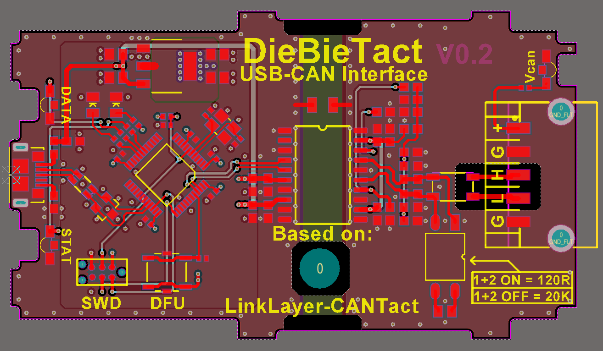
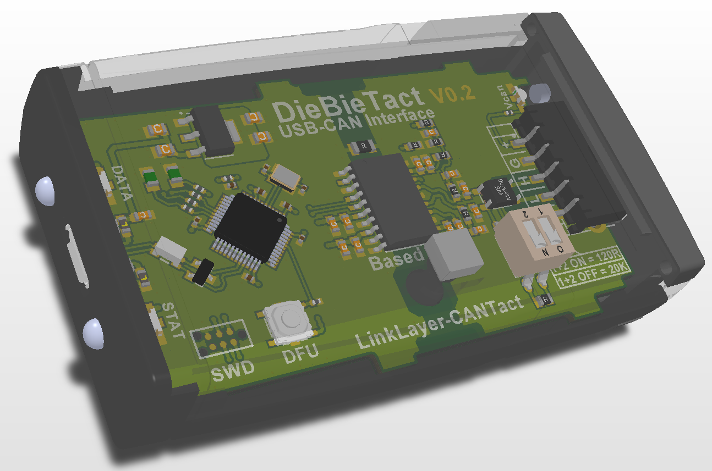
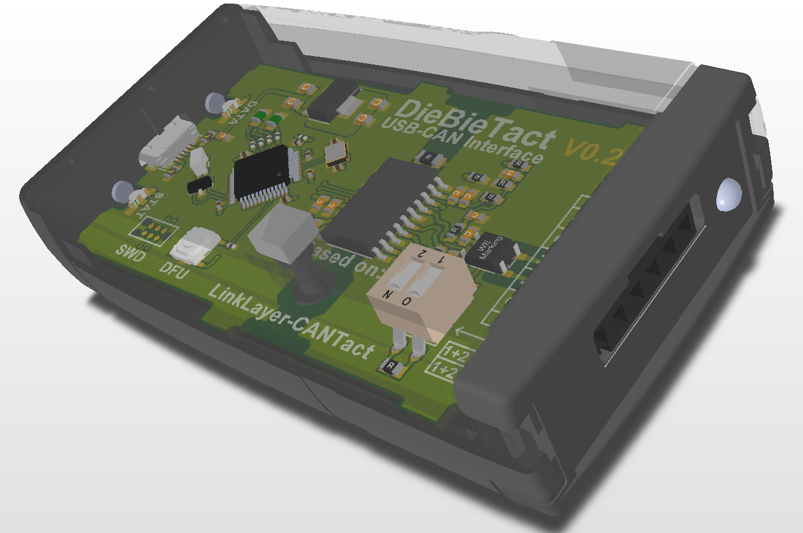

# DieBieCANToUSB

This CAN to USB converter is based on the [linklayer cantact hardware](https://github.com/linklayer/cantact-hw), I used the schematic to have its CAN port isolated and that it fits in an enclosure ( BOPLA-Arteb 115 ). The schematic is the same so its works with the same [firmware](https://github.com/linklayer/cantact-fw).

You can find the schematic [here](Project%20Outputs%20for%20DB10025_CANToUSB/DB10025_CANToUSB.PDF).

It looks like this:

